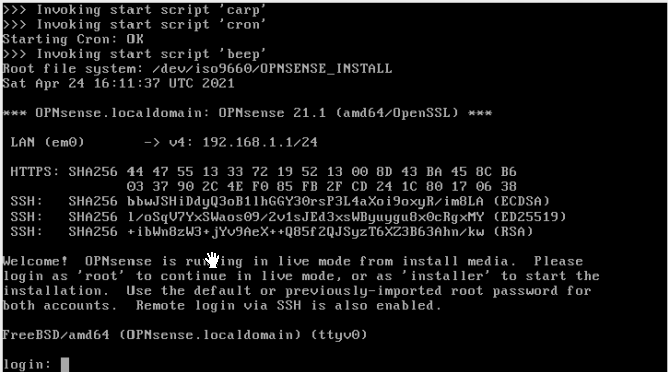
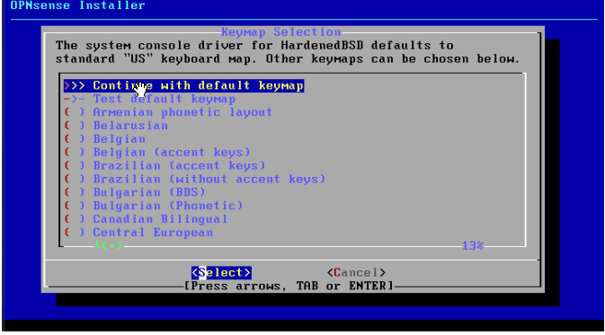
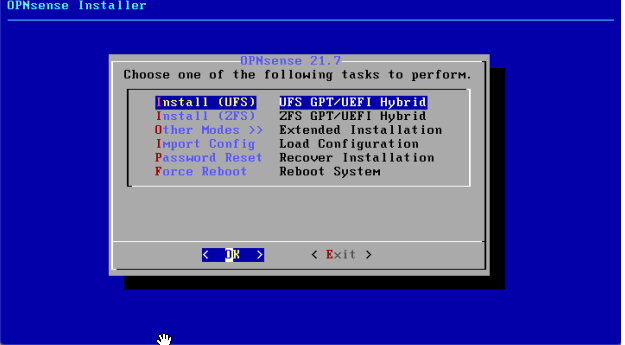
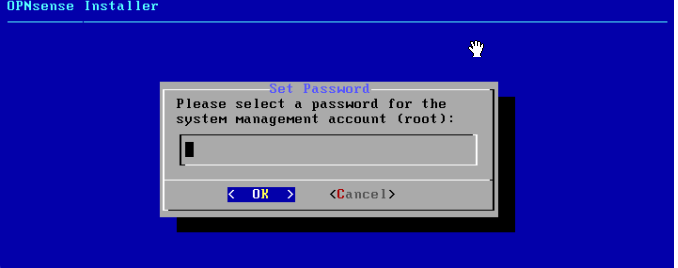
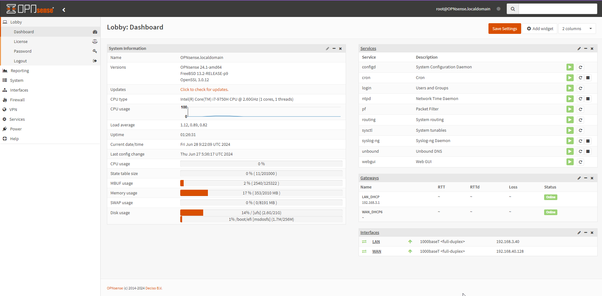
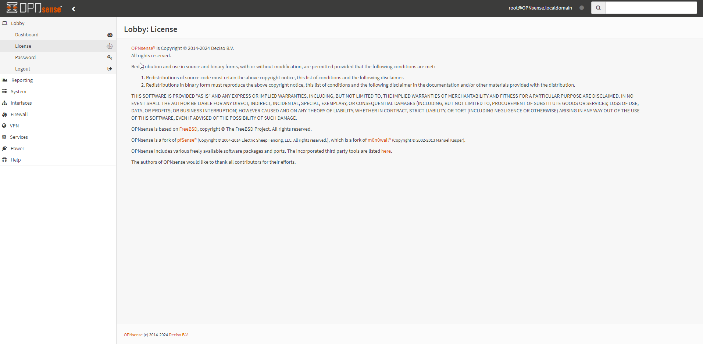
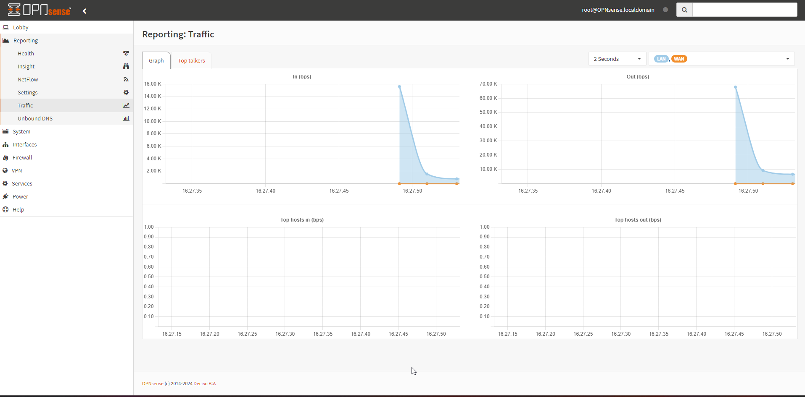
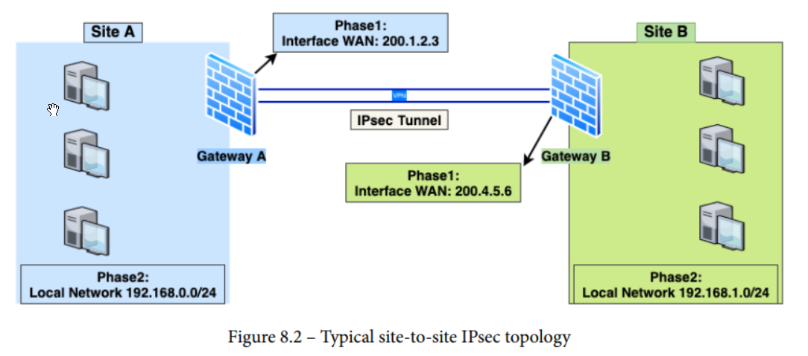

# Day 27 
> [!NOTE]
> 
> ....

## Overview Project 1
- Install Windows Server 
- Setting up and configuring services in windows server 
  - domain controller
  - dhcp
  - ...
- Setting up ELK
- Configuring Winlogbeat 
- Windows 10 ISO
- pfSenses

## Install and Setup pfSenses

## Install and Setup OPNSense

- installer:opnsense
- root:password

- UFS
- ZFS
- Other Modes

- disk

- Change root's password

- Remove ISO

:books: Configuring network interfaces

:books: Updating firmware

- Checking for system updates in WebGUI
- Checking system updates using the CLI

:books: Installing plugins 

:books: Advanced - Accessing the CLI through SSH

:books: FreeBSD packages

## OPNsense UI

## Setup Site-to-site IPsec 

- 

## Error 

- How to fix Ubuntu VMware Workstation Bridge Network connection issue?
  - https://www.youtube.com/watch?v=ISr4rQbY1jo

## References 

* [x] OPNsense Beginner to Professional
* [ ] MASTERING PFSENSE  master the art of managing, securing, and monitoring your on-premises and ... cloud network using the... 
* [ ] Mastering Palo Alto Networks Build, configure, and deploy network solutions for your infrastructure using features of PAN-OS,... 
