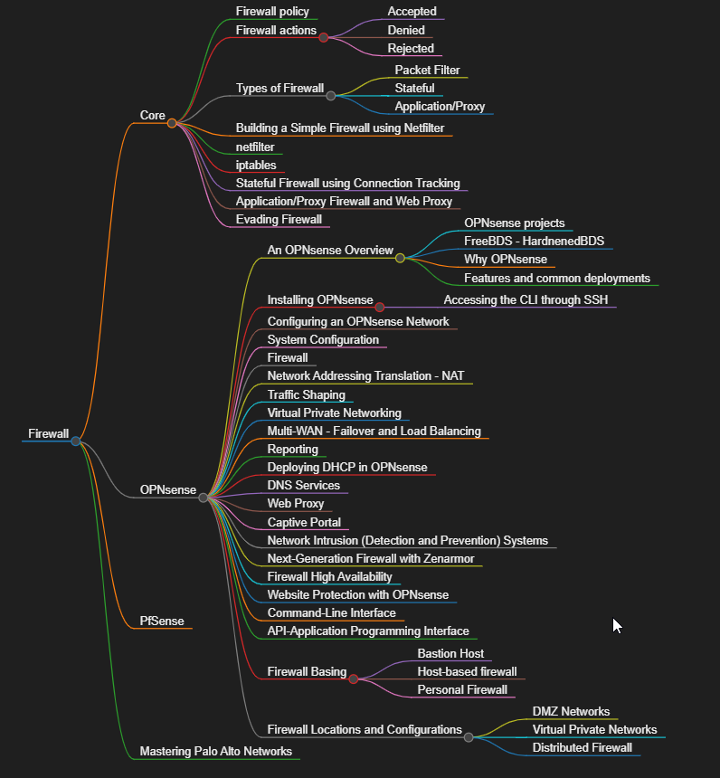
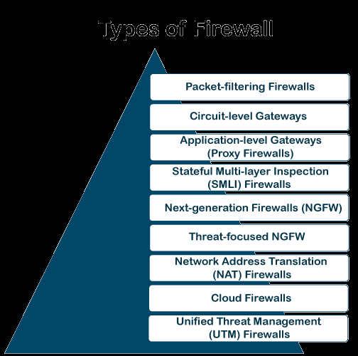
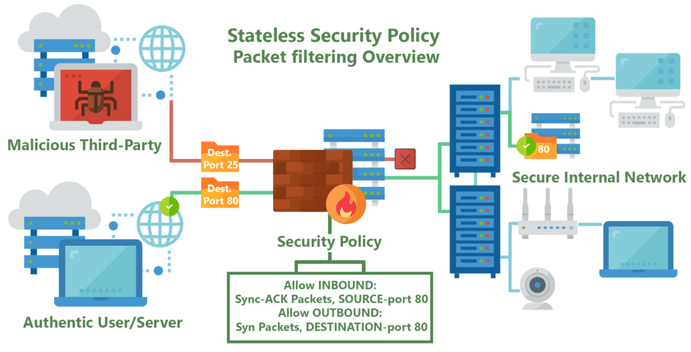
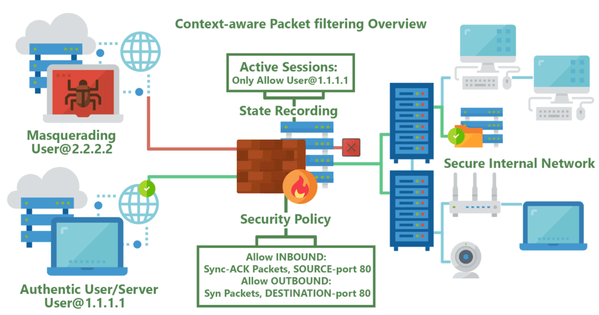
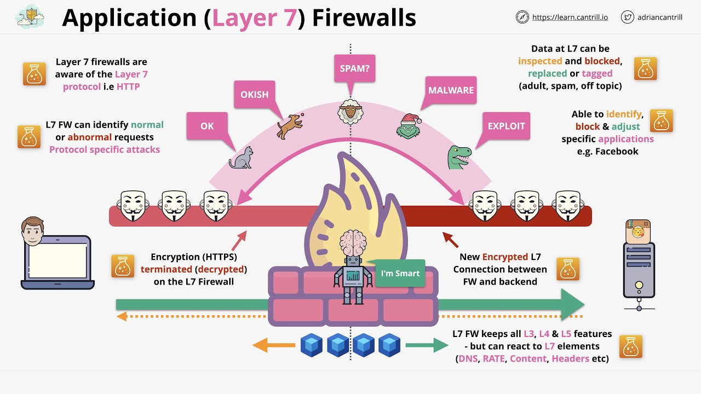
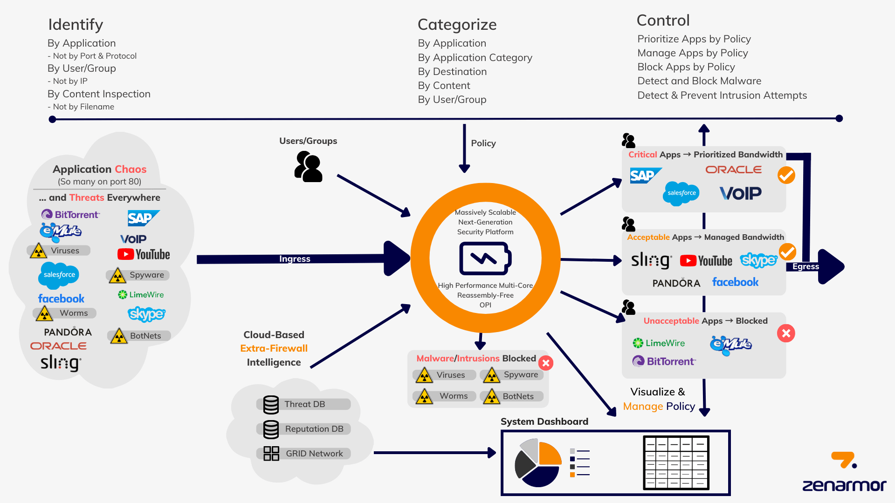

# firewall-practices

## Firewall Policy
A firewall policy is a set of rules and standards that control network traffic between an organization's internal network and the internet.

By default, firewall policy rules are stateful: if client-to-server traffic is allowed, the session is maintained in a state table, and the response traffic is allowed.

> Firewall policy là một tập hợp các quy tắc và quy định được thiết lập để kiểm soát và quản lý lưu lượng mạng giữa các mạng khác nhau hoặc giữa các thiết bị trong cùng một mạng. Mục tiêu chính của  firewall policy là bảo vệ mạng khỏi các mối đe dọa, như tấn công từ bên ngoài, và đảm bảo rằng chỉ  có các lưu lượng mạng được phép mới có thể truy cập vào hoặc rời khỏi mạng.
> 
> Các yếu tố chính của một firewall policy bao gồm:
> 
> 1.  **Quy tắc cho phép và từ chối**: Xác định lưu lượng mạng nào được phép đi qua firewall và lưu  lượng nào bị chặn. Các quy tắc này thường dựa trên các yếu tố như địa chỉ IP, cổng, giao thức, và  hướng lưu lượng (vào hoặc ra).
> 
> 2.  **Kiểm soát truy cập**: Xác định ai (người dùng hoặc thiết bị) được phép truy cập vào tài > nguyên mạng nào, và trong những điều kiện nào.
> 
> 3.  **Định nghĩa các vùng bảo mật**: Phân chia mạng thành các vùng bảo mật khác nhau (ví dụ: mạng  nội bộ, DMZ, mạng công cộng) và áp dụng các chính sách khác nhau cho từng vùng.
> 
> 4.  **Quản lý và giám sát**: Định nghĩa các quy trình và công cụ để giám sát và ghi lại lưu lượng  mạng, phát hiện và phản ứng với các sự cố bảo mật.
> 
> 5.  **Cập nhật và duy trì**: Đảm bảo rằng firewall policy được cập nhật thường xuyên để phản ánh  các thay đổi trong môi trường mạng và các mối đe dọa bảo mật mới.
> 
> Việc thiết lập và duy trì một firewall policy hiệu quả là một phần quan trọng của an ninh mạng,  giúp bảo vệ dữ liệu và tài nguyên quan trọng khỏi các cuộc tấn công và xâm nhập trái phép.

## Firewall actions
Các hành động của firewall (tường lửa) thường được xác định trong các quy tắc và chính sách của tường lửa để kiểm soát lưu lượng mạng. Dưới đây là một số hành động phổ biến mà tường lửa có thể thực hiện:

1.  **Allow (Cho phép)**: Cho phép lưu lượng mạng đi qua tường lửa. Lưu lượng này sẽ được gửi đến đích dự kiến của nó mà không bị chặn.

2.  **Deny (Từ chối)**: Chặn lưu lượng mạng, không cho phép nó đi qua tường lửa. Lưu lượng này sẽ bị loại bỏ mà không có thông báo cho người gửi.

3.  **Drop (Bỏ qua)**: Tương tự như "Deny", nhưng thường không gửi lại thông báo lỗi cho người gửi. Lưu lượng bị loại bỏ im lặng mà không có phản hồi.

4.  **Reject (Từ chối với thông báo)**: Chặn lưu lượng mạng và gửi lại một thông báo lỗi cho người gửi, thông báo rằng lưu lượng đã bị chặn.

5.  **Log (Ghi nhật ký)**: Ghi lại thông tin về lưu lượng mạng vào nhật ký tường lửa để quản trị viên có thể xem xét sau. Điều này giúp giám sát và phát hiện các hoạt động bất thường hoặc các sự cố bảo mật.

6.  **NAT (Network Address Translation)**: Thay đổi địa chỉ IP của lưu lượng mạng khi nó đi qua tường lửa. Có thể là NAT nguồn (thay đổi địa chỉ IP nguồn) hoặc NAT đích (thay đổi địa chỉ IP đích).

7.  **Masquerade**: Một dạng của NAT, thường được sử dụng để ẩn địa chỉ IP nội bộ khi truy cập Internet, hiển thị tất cả lưu lượng đi ra ngoài như thể nó đến từ một địa chỉ IP duy nhất.

8.  **Forward (Chuyển tiếp)**: Chuyển tiếp lưu lượng mạng đến một thiết bị hoặc mạng khác. Hành động này thường được sử dụng trong các cấu hình DMZ hoặc để chuyển tiếp các yêu cầu đến máy chủ cụ thể.

9.  **Shape (Điều chỉnh băng thông)**: Điều chỉnh băng thông của lưu lượng mạng để kiểm soát tốc độ truyền tải. Điều này có thể giúp quản lý tải mạng và đảm bảo rằng các ứng dụng quan trọng có đủ băng thông.

10.  **Inspect (Kiểm tra)**: Kiểm tra sâu lưu lượng mạng để phát hiện các mẫu tấn công hoặc các hoạt động đáng ngờ. Các firewall tiên tiến thường sử dụng kiểm tra sâu gói tin (DPI - Deep Packet Inspection) để thực hiện hành động này.

Các hành động này giúp quản trị viên mạng kiểm soát và bảo vệ mạng khỏi các mối đe dọa, đảm bảo rằng chỉ có lưu lượng hợp lệ và được phép mới có thể đi qua tường lửa.
## Types of Firewall

* Packet-filering Firewalls
* Circuit-level Gateways
* Application-level Gateways
* Stateful Multi-layer Inspection Firewall
* Next-Generation Firewalls
* Threat-focesed NGFW
* Network Address Translation (NAT) Firewalls
* cloud Firewalls
* Unified Threaet Managements Firewall

---
> [!NOTE]
> 
> * Simple Packet Filter Firewall 
> * Stateful Packet Filter Firewalls 
> * Application-Proxy Gateways hay Application-Level Firewall
> * Next Generation Firewalls 

### Simple/Stateless Packet Filter Firewall
- Kiểm tra gói tin qua firewall bằng cách so sánh nó với những nguyên tắt (rule) đã đươc đặt ra, để guyết định gói tin đó được cho phép hay bị từ chối.
- Source, Destination IP
- Protocol
- Source, Destination Port
=> Hoạt động chủ yếu cở Layer 2, 3

### Stateful Packet Filter Firewall
- Tính năng của Packet Filtering Firewall
- Có thêm phần lưu lại trang thái (stateful table)
- Stateful table
- Hoạt động ở layer 2,3,4
- Những khắc phục so với Simple Packet Filter Firewalls

### Application-Level Firewall - Application-Proxy Gateways
- Deep Packet Inspection: kiểm tra chi tiết gói tin nên có khả ngăn chặn các ứng dụng Instant Message, Peer to Peer,
- Có khả năng xác thực
- UserID và Password
- Hardware hoặc Software Token 
- Source Address
- Biometric

### Next-Gen Firewall 

1.	Xác định các ứng dụng (applications) bất kể là port, protocol, hay chiến thuật né tránh hoặc SSL 
2.	Xác định User bất kể IP address
3.	Khả năng hiển thị chi tiết và kiểm soát chính sách đối với quyền truy cập / chức năng của ứng dụng
4.	Bảo vệ trong thời gian thực chống lại các mối đe dọa được nhúng trên các ứng dụng
5.	Multi-gigabit, triển khai trực tuyến mà không làm giảm hiệu suất

Định nghĩa:
* Standard firewall capabilities like stateful inspection 
* Integrated intrusion prevention
* Application awareness and control to see and block risk apps
* Threat intelligence source
* Upgrade paths to include future information feeds
* Techniques to address evolving security threats

Security
* Deep packet inspection 
* Intrusion prevention 
* SSL Decryption 

Application Awareness 
* Fingerprint applications 
* Identify Users 
* Visualize traffic

Performance 
* High Throughput
* No latency
* Any size network 

Nguyên lý hoạt động
* Deploy
* Inbound
* Outbound

## Firewall logs and analysis

## Bypass Firewall
## Web Application Firewall
## Databse firewalls

## API Firewalls

## Modesecurity 

## Terms

### Inbound vs. Outbound

1.  **Inbound (Lưu lượng vào)**

    -   **Định nghĩa**: Lưu lượng mạng đến từ bên ngoài và đi vào một mạng nội bộ.
    -   **Ví dụ**: Yêu cầu từ người dùng internet bên ngoài truy cập vào máy chủ web trong mạng nội bộ.
2.  **Outbound (Lưu lượng ra)**

    -   **Định nghĩa**: Lưu lượng mạng rời khỏi mạng nội bộ và đi đến bên ngoài.
    -   **Ví dụ**: Một máy tính trong mạng nội bộ gửi yêu cầu truy cập đến một trang web trên internet.

### Ingress vs. Egress

3.  **Ingress (Lưu lượng đi vào)**

    -   **Định nghĩa**: Lưu lượng mạng đi vào một giao diện mạng cụ thể.
    -   **Ví dụ**: Một gói dữ liệu đến từ internet và đi vào cổng (interface) của router hoặc firewall.
4.  **Egress (Lưu lượng đi ra)**

    -   **Định nghĩa**: Lưu lượng mạng rời khỏi một giao diện mạng cụ thể.
    -   **Ví dụ**: Một gói dữ liệu rời khỏi cổng (interface) của router hoặc firewall để đi đến internet.

### Các thuật ngữ khác

5.  **Internal (Nội bộ)**

    -   **Định nghĩa**: Lưu lượng hoặc tài nguyên nằm bên trong một mạng nội bộ.
    -   **Ví dụ**: Giao tiếp giữa các máy tính trong cùng một mạng LAN.
6.  **External (Bên ngoài)**

    -   **Định nghĩa**: Lưu lượng hoặc tài nguyên nằm bên ngoài mạng nội bộ.
    -   **Ví dụ**: Truy cập đến một máy chủ web nằm trên internet từ mạng nội bộ.
7.  **Uplink**

    -   **Định nghĩa**: Kết nối từ một mạng nhỏ hơn (ví dụ: mạng nội bộ) lên một mạng lớn hơn hoặc đến một nhà cung cấp dịch vụ (ISP).
    -   **Ví dụ**: Kết nối từ router nội bộ đến modem của ISP.
8.  **Downlink**

    -   **Định nghĩa**: Kết nối từ một mạng lớn hơn hoặc nhà cung cấp dịch vụ xuống một mạng nhỏ hơn.
    -   **Ví dụ**: Kết nối từ modem của ISP đến router nội bộ.
9.  **North-South Traffic**

    -   **Định nghĩa**: Lưu lượng đi vào hoặc rời khỏi trung tâm dữ liệu hoặc mạng.
    -   **Ví dụ**: Truy cập từ một người dùng bên ngoài vào một ứng dụng chạy trong trung tâm dữ liệu.
10.  **East-West Traffic**

    -   **Định nghĩa**: Lưu lượng giữa các máy chủ hoặc thiết bị bên trong cùng một trung tâm dữ liệu hoặc mạng.
    -   **Ví dụ**: Giao tiếp giữa các máy ảo trong cùng một trung tâm dữ liệu.

Các thuật ngữ này giúp hiểu rõ hơn về hướng và nguồn gốc của lưu lượng mạng, từ đó có thể thiết lập các chính sách bảo mật và quản lý mạng hiệu quả hơn.

## References 
* Types of firewalls: https://www.javatpoint.com/types-of-firewall
* Awesome-WAF: https://github.com/0xInfection/Awesome-WAF
* Types of network Firewalls: https://www.geeksforgeeks.org/types-of-network-firewall/
* Different between traditional fireall and next generation fireall: https://www.geeksforgeeks.org/difference-between-traditional-firewall-and-next-generation-firewall/
* API firewalls: https://github.com/wallarm/api-firewall
