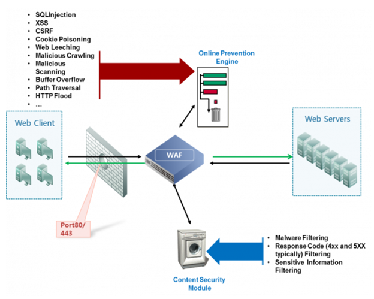
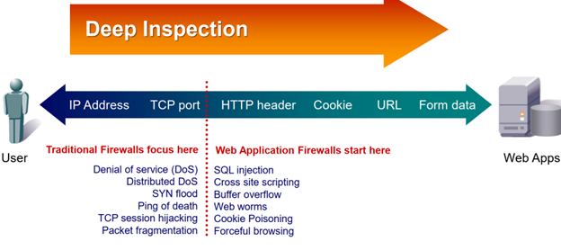
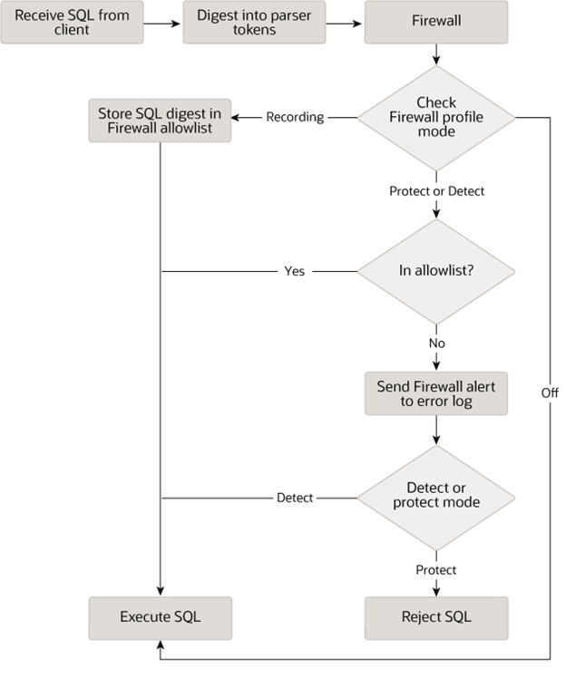
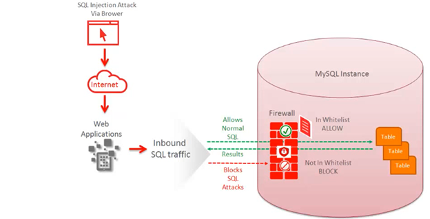
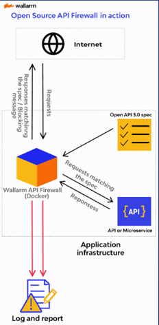

# firewall-practices

- [firewall-practices](#firewall-practices)
  - [Firewall Policy](#firewall-policy)
  - [Firewall actions](#firewall-actions)
  - [Types of Firewall](#types-of-firewall)
    - [Simple/Stateless Packet Filter Firewall](#simplestateless-packet-filter-firewall)
    - [Stateful Packet Filter Firewall](#stateful-packet-filter-firewall)
    - [Application-Level Firewall - Application-Proxy Gateways](#application-level-firewall---application-proxy-gateways)
    - [Next-Gen Firewall](#next-gen-firewall)
  - [Firewall logs and analysis](#firewall-logs-and-analysis)
  - [Bypass Firewall](#bypass-firewall)
  - [Web Application Firewall](#web-application-firewall)
    - [Compare: NGFW and WAF](#compare-ngfw-and-waf)
  - [Database firewall - MySQL Enterprise Firewall](#database-firewall---mysql-enterprise-firewall)
  - [API Firewalls](#api-firewalls)
  - [Modesecurity (WAF)](#modesecurity-waf)
    - [Các tính năng chính của ModSecurity](#các-tính-năng-chính-của-modsecurity)
    - [Cấu hình và sử dụng ModSecurity](#cấu-hình-và-sử-dụng-modsecurity)
      - [Ví dụ: Cấu hình ModSecurity trên Apache](#ví-dụ-cấu-hình-modsecurity-trên-apache)
    - [Ví dụ về quy tắc ModSecurity](#ví-dụ-về-quy-tắc-modsecurity)
    - [Kết luận](#kết-luận)
  - [Firewall and Python](#firewall-and-python)
  - [Terms](#terms)
    - [Inbound vs. Outbound](#inbound-vs-outbound)
    - [Ingress vs. Egress](#ingress-vs-egress)
    - [Các thuật ngữ khác](#các-thuật-ngữ-khác)
  - [References](#references)


## Firewall Policy
A firewall policy is a set of rules and standards that control network traffic between an organization's internal network and the internet.

By default, firewall policy rules are stateful: if client-to-server traffic is allowed, the session is maintained in a state table, and the response traffic is allowed.

> Firewall policy là một tập hợp các quy tắc và quy định được thiết lập để kiểm soát và quản lý lưu lượng mạng giữa các mạng khác nhau hoặc giữa các thiết bị trong cùng một mạng. Mục tiêu chính của  firewall policy là bảo vệ mạng khỏi các mối đe dọa, như tấn công từ bên ngoài, và đảm bảo rằng chỉ  có các lưu lượng mạng được phép mới có thể truy cập vào hoặc rời khỏi mạng.
> 
> Các yếu tố chính của một firewall policy bao gồm:
> 
> 1.  **Quy tắc cho phép và từ chối**: Xác định lưu lượng mạng nào được phép đi qua firewall và lưu  lượng nào bị chặn. Các quy tắc này thường dựa trên các yếu tố như địa chỉ IP, cổng, giao thức, và  hướng lưu lượng (vào hoặc ra).
> 
> 2.  **Kiểm soát truy cập**: Xác định ai (người dùng hoặc thiết bị) được phép truy cập vào tài > nguyên mạng nào, và trong những điều kiện nào.
> 
> 3.  **Định nghĩa các vùng bảo mật**: Phân chia mạng thành các vùng bảo mật khác nhau (ví dụ: mạng  nội bộ, DMZ, mạng công cộng) và áp dụng các chính sách khác nhau cho từng vùng.
> 
> 4.  **Quản lý và giám sát**: Định nghĩa các quy trình và công cụ để giám sát và ghi lại lưu lượng  mạng, phát hiện và phản ứng với các sự cố bảo mật.
> 
> 5.  **Cập nhật và duy trì**: Đảm bảo rằng firewall policy được cập nhật thường xuyên để phản ánh  các thay đổi trong môi trường mạng và các mối đe dọa bảo mật mới.
> 
> Việc thiết lập và duy trì một firewall policy hiệu quả là một phần quan trọng của an ninh mạng,  giúp bảo vệ dữ liệu và tài nguyên quan trọng khỏi các cuộc tấn công và xâm nhập trái phép.

## Firewall actions
Các hành động của firewall (tường lửa) thường được xác định trong các quy tắc và chính sách của tường lửa để kiểm soát lưu lượng mạng. Dưới đây là một số hành động phổ biến mà tường lửa có thể thực hiện:

1.  **Allow (Cho phép)**: Cho phép lưu lượng mạng đi qua tường lửa. Lưu lượng này sẽ được gửi đến đích dự kiến của nó mà không bị chặn.

2.  **Deny (Từ chối)**: Chặn lưu lượng mạng, không cho phép nó đi qua tường lửa. Lưu lượng này sẽ bị loại bỏ mà không có thông báo cho người gửi.

3.  **Drop (Bỏ qua)**: Tương tự như "Deny", nhưng thường không gửi lại thông báo lỗi cho người gửi. Lưu lượng bị loại bỏ im lặng mà không có phản hồi.

4.  **Reject (Từ chối với thông báo)**: Chặn lưu lượng mạng và gửi lại một thông báo lỗi cho người gửi, thông báo rằng lưu lượng đã bị chặn.

5.  **Log (Ghi nhật ký)**: Ghi lại thông tin về lưu lượng mạng vào nhật ký tường lửa để quản trị viên có thể xem xét sau. Điều này giúp giám sát và phát hiện các hoạt động bất thường hoặc các sự cố bảo mật.

6.  **NAT (Network Address Translation)**: Thay đổi địa chỉ IP của lưu lượng mạng khi nó đi qua tường lửa. Có thể là NAT nguồn (thay đổi địa chỉ IP nguồn) hoặc NAT đích (thay đổi địa chỉ IP đích).

7.  **Masquerade**: Một dạng của NAT, thường được sử dụng để ẩn địa chỉ IP nội bộ khi truy cập Internet, hiển thị tất cả lưu lượng đi ra ngoài như thể nó đến từ một địa chỉ IP duy nhất.

8.  **Forward (Chuyển tiếp)**: Chuyển tiếp lưu lượng mạng đến một thiết bị hoặc mạng khác. Hành động này thường được sử dụng trong các cấu hình DMZ hoặc để chuyển tiếp các yêu cầu đến máy chủ cụ thể.

9.  **Shape (Điều chỉnh băng thông)**: Điều chỉnh băng thông của lưu lượng mạng để kiểm soát tốc độ truyền tải. Điều này có thể giúp quản lý tải mạng và đảm bảo rằng các ứng dụng quan trọng có đủ băng thông.

10.  **Inspect (Kiểm tra)**: Kiểm tra sâu lưu lượng mạng để phát hiện các mẫu tấn công hoặc các hoạt động đáng ngờ. Các firewall tiên tiến thường sử dụng kiểm tra sâu gói tin (DPI - Deep Packet Inspection) để thực hiện hành động này.

Các hành động này giúp quản trị viên mạng kiểm soát và bảo vệ mạng khỏi các mối đe dọa, đảm bảo rằng chỉ có lưu lượng hợp lệ và được phép mới có thể đi qua tường lửa.
## Types of Firewall

<div align="center">

</div>

* Packet-filering Firewalls
* Circuit-level Gateways
* Application-level Gateways
* Stateful Multi-layer Inspection Firewall
* Next-Generation Firewalls
* Threat-focesed NGFW
* Network Address Translation (NAT) Firewalls
* cloud Firewalls
* Unified Threaet Managements Firewall

---
> [!NOTE]
> 
> * Simple Packet Filter Firewall 
> * Stateful Packet Filter Firewalls 
> * Application-Proxy Gateways hay Application-Level Firewall
> * Next Generation Firewalls 


### Simple/Stateless Packet Filter Firewall
- Kiểm tra gói tin qua firewall bằng cách so sánh nó với những nguyên tắt (rule) đã đươc đặt ra, để guyết định gói tin đó được cho phép hay bị từ chối.
- Source, Destination IP
- Protocol
- Source, Destination Port
=> Hoạt động chủ yếu cở Layer 2, 3
<div align="center">

</div>

### Stateful Packet Filter Firewall
- Tính năng của Packet Filtering Firewall
- Có thêm phần lưu lại trang thái (stateful table)
- Stateful table
- Hoạt động ở layer 2,3,4
- Những khắc phục so với Simple Packet Filter Firewalls

<div align="center">

</div>


### Application-Level Firewall - Application-Proxy Gateways
- Deep Packet Inspection: kiểm tra chi tiết gói tin nên có khả ngăn chặn các ứng dụng Instant Message, Peer to Peer,
- Có khả năng xác thực
- UserID và Password
- Hardware hoặc Software Token 
- Source Address
- Biometric


<div align="center">

</div>

### Next-Gen Firewall 

1.	Xác định các ứng dụng (applications) bất kể là port, protocol, hay chiến thuật né tránh hoặc SSL 
2.	Xác định User bất kể IP address
3.	Khả năng hiển thị chi tiết và kiểm soát chính sách đối với quyền truy cập / chức năng của ứng dụng
4.	Bảo vệ trong thời gian thực chống lại các mối đe dọa được nhúng trên các ứng dụng
5.	Multi-gigabit, triển khai trực tuyến mà không làm giảm hiệu suất

Định nghĩa:
* Standard firewall capabilities like stateful inspection 
* Integrated intrusion prevention
* Application awareness and control to see and block risk apps
* Threat intelligence source
* Upgrade paths to include future information feeds
* Techniques to address evolving security threats


Security
* Deep packet inspection 
* Intrusion prevention 
* SSL Decryption 

Application Awareness 
* Fingerprint applications 
* Identify Users 
* Visualize traffic

Performance 
* High Throughput
* No latency
* Any size network 

Nguyên lý hoạt động
* Deploy
* Inbound
* Outbound

<div align="center">

</div>


## Firewall logs and analysis
Phân tích log firewall là một phần quan trọng trong quản lý bảo mật mạng, giúp phát hiện các hành vi bất thường, các cuộc tấn công và xác định các điểm yếu trong hệ thống. Dưới đây là các bước cơ bản và ví dụ về cách sử dụng Python để thu thập, phân tích và trực quan hóa log firewall.

1. Thu thập log firewall
2. Phân tích log firewall
3. Trực quan hóa log firewall
4. Phát hiện bất thường và tấn công 
5. Tự động hóa thông báo


## Bypass Firewall

## Web Application Firewall

Định nghĩa
- Filter, monitors and blocks HTTP/HTTPS traffic to and from a web application
- Sự khác biệt giữa WAF và tường lửa thông thường
Tại sao cần WAF
- Khi các công ty và users ngày càng phụ thuộc vào các ứng dụng web (Web Application), chẳng hạn như email dựa trên web hoặc chức năng e-Commerce, các cuộc tấn công nhằm vào lớp ứng dụng gây ra rủi ro lớn hơn cho năng suất và bảo mật. Do đó, WAF thật sự rất quan trọng nhằm bảo vệ khỏi các mối đe dọa liên quan đến bảo mật web.
- WAF bảo vệ bạn khỏi các cuộc tấn công độc hại, chẳng hạn như: 
  - SQL Injection: một công nghệ hack được sử dụng để trích xuất thông tin nhạy cảm từ database. 
  - Remote Code Execution: một kỹ thuật tấn công cho phép một người thực thi code từ xa sau khi user chấp nhận file độc hại. 
  - Cross-site scripting: khi script độc hại được đưa vào code của một trang web đáng tin cậy khác, sẽ cho phép dữ liệu nhạy cảm của user như cookie bị truy cập. 
- Những mối đe dọa này có thể xâm nhập và làm tê liệt trang web của bạn, làm giảm hiệu suất và khiến doanh nghiệp của bạn bị mất dữ liệu.
Top 10 OWASP
- Broken Access Control
  - moves up from the fifth position; 94% of applications were tested for some form of broken access control. The 34 Common Weakness Enumerations (CWEs) mapped to Broken Access Control had more occurrences in applications than any other category.

- Cryptographic Failures 
  - shifts up one position to #2, previously known as Sensitive Data Exposure, which was broad symptom rather than a root cause. The renewed focus here is on failures related to cryptography which often leads to sensitive data exposure or system compromise.
- Injection 
  - slides down to the third position. 94% of the applications were tested for some form of injection, and the 33 CWEs mapped into this category have the second most occurrences in applications. Cross-site Scripting is now part of this category in this edition.
- Insecure Design 
  - is a new category for 2021, with a focus on risks related to design flaws. If we genuinely want to “move left” as an industry, it calls for more use of threat modeling, secure design patterns and principles, and reference architectures.
- Security Misconfiguration 
  - moves up from #6 in the previous edition; 90% of applications were tested for some form of misconfiguration. With more shifts into highly configurable software, it’s not surprising to see this category move up. The former category for XML External Entities (XXE) is now part of this category.
- Vulnerable and Outdated Components 
  - was previously titled Using Components with Known Vulnerabilities and is #2 in the Top 10 community survey, but also had enough data to make the Top 10 via data analysis. This category moves up from #9 in 2017 and is a known issue that we struggle to test and assess risk. It is the only category not to have any Common Vulnerability and Exposures (CVEs) mapped to the included CWEs, so a default exploit and impact weights of 5.0 are factored into their scores.
- Identification and Authentication Failures 
  - was previously Broken Authentication and is sliding down from the second position, and now includes CWEs that are more related to identification failures. This category is still an integral part of the Top 10, but the increased availability of standardized frameworks seems to be helping.
- Software and Data integrity Failures 
  - is a new category for 2021, focusing on making assumptions related to software updates, critical data, and CI/CD pipelines without verifying integrity. One of the highest weighted impacts from Common Vulnerability and Exposures/Common Vulnerability Scoring System (CVE/CVSS) data mapped to the 10 CWEs in this category. Insecure Deserialization from 2017 is now a part of this larger category.
- Security Logging and Monitoring Failures 
  - was previously Insufficient Logging & Monitoring and is added from the industry survey (#3), moving up from #10 previously. This category is expanded to include more types of failures, is challenging to test for, and isn’t well represented in the CVE/CVSS data. However, failures in this category can directly impact visibility, incident alerting, and forensics.
- Server-Side Request Forgery SSRF
  - is added from the Top 10 community survey (#1). The data shows a relatively low incidence rate with above average testing coverage, along with above-average ratings for Exploit and Impact potential. This category represents the scenario where the security community members are telling us this is important, even though it’s not illustrated in the data at this time.


Cách Web Application Firewall hoạt động
- WAF được triển khai trước các ứng dụng web và phân tích lưu lượng HTTP – kiểm tra cả request GET và POST nhằm phát hiện và chặn bất kỳ thứ gì độc hại.
- Không giống như tường lửa (Firewall) thông thường chỉ đóng vai trò như một cổng an toàn giữa các server, WAF là một biện pháp bảo mật ứng dụng được đặt giữa Web Client và  Web Server.
- Các cuộc tấn công độc hại đến máy tính thường được tự động hóa. Những loại tấn công này rất khó phát hiện vì chúng thường được thiết kế để bắt chước giống lưu lượng truy cập của con người và không bị phát hiện.
- WAF thực hiện kiểm tra chi tiết mọi request và response đối với tất cả các dạng lưu lượng truy cập web phổ biến. Việc kiểm tra này giúp WAF xác định và chặn các mối đe dọa, ngăn chúng xâm nhập vào server.
Web Attack Damage 
- Loss of sensitive data
- Defaced Web Site
- Lost Business 
  - Web site blocked by search engines and AV software 
  - Loss of customer trust


Why we need to use WAF?

<div align="center">

</div>

<div align="center">

</div>

### Compare: NGFW and WAF

NGFW and WAF
-  WAF (web application firewall):
   - A web application firewall (WAF) is a type of firewall that monitors, filters or blocks HTTP traffic to and from a web application. It differs from a normal firewall in that it can filter the content of specific web applications, whereas a network firewall protects traffic between servers. By inspecting HTTP traffic, a WAF protects web applications against attacks such as SQL injection, XSS and cross-site request forgery (CSRF).
   - It is usually aware of the user, the session and the application and knows the web applications behind it and the services they offer. The WAF can therefore be seen as an intermediary between the user and the application itself, which analyses all communications before they reach the application or the user. Traditional WAFs ensure that only permitted actions can be performed (depending on the security policy). For many organisations, WAFs are a reliable first line of defence for applications, especially to protect against the OWASP Top 10.
- NGFW (next generation firewall)
  - It monitors traffic going out to the Internet (via websites, email accounts and SaaS). In short, it protects the user (versus the web application). The NGFW enforces user-based policies and adds context to security policies, in addition to other functions such as URL filtering, anti-virus/anti-malware, and potentially, its own intrusion prevention systems (IPS). While the WAF is typically a reverse proxy (used by servers), the NGFW is typically a forward proxy (used by clients as a browser).
  - Traditional firewalls are divided into three functions: Filter, inspect and allow or disallow. While NGFW firewalls offer a range of additional protection such as detection and prevention of malware and DDoS attacks, WAFs offer protection against web threats (such as phishing hack attempts).


## Database firewall - MySQL Enterprise Firewall
•	MySQL Enterprise Edition includes MySQL Enterprise Firewall, an application-level firewall that enables database administrators to permit or deny SQL statement execution based on matching against lists of accepted statement patterns. This helps harden MySQL Server against attacks such as SQL injection or attempts to exploit applications by using them outside of their legitimate query workload characteristics.
•	Each MySQL account registered with the firewall has its own statement allowlist, enabling protection to be tailored per account. For a given account, the firewall can operate in recording, protecting, or detecting mode, for training in the accepted statement patterns, active protection against unacceptable statements, or passive detection of unacceptable statements. The diagram illustrates how the firewall processes incoming statements in each mode.

<div align="center">

</div>

<div align="center">

</div>


Multiple operating modes:
* Recording-Allow – exes queries & generates results for queries match an allowlist.
* Protecting-Block – blocks queries don’t match an allowlist.
* Detecting-Detect - exes queries don’t match an allowlist + notifies admins of policy violations.
* Tường lửa cơ sở dữ liệu (CSDL): là một loại WAF (thiết bị / phần mềm, ảo hóa) dùng giám sát CSDL để xác định và bảo vệ chống lại các cuộc tấn công nhắm đến CSDL (đánh cắp thông tin nhạy cảm trong CSDL) và kiểm tra hoạt động truy cập vào CSDL thông qua log. Nó có thể được triển khai in-line với máy chủ CSDL (ngay trước) / gần cổng mạng (bảo vệ nhiều CSDL trong nhiều máy chủ). Một số máy chủ CSDL hỗ trợ các agent có thể được cài đặt trong chính máy chủ CSDL để theo dõi các sự kiện CSDL cục bộ. Tường lửa dựa trên phần cứng hỗ trợ giám sát máy chủ / mạng mà không cần tải bổ sung thứ gì trên các máy chủ CSDL. Cả thiết bị phần cứng và tác nhân phần mềm có thể được triển khai để hoạt động đồng thời.
* MySQL Enterprise Firewall: là 1 plugin của MySQL Enterprise Edition. Chỉ cần tải MySQL Enterprise Edition về và enable plugin tường lửa là có thể sử dụng. Đây là tường lửa cấp ứng dụng với tính năng bảo vệ theo thời gian thực bằng cách giám sát, cảnh báo và ngăn chặn hoạt động tác động trái phép đến CSDL mà không có bất kỳ thay đổi nào với ứng dụng.


Các chế độ hoạt động:
* Ghi - Thực thi Các câu lệnh SQL được và tổng quát hóa để xây dựng 1 allowlist.
* Bảo vệ - Các câu lệnh SQL không khớp với allowlist bị chặn thực thi.
* Phát hiện - Các câu lệnh SQL không khớp với allowlist được thực thi và thông báo cho quản trị viên các hoạt động đáng ngờ.


Cơ chế hoạt động:
* Máy chủ MySQL nhận kết nối từ máy khách và các câu lệnh SQL. Nếu tường lửa được bật, nó sẽ nhận các câu truy vấn này và xem xét có chấp nhận câu lệnh hay không, dựa vào đó máy chủ sẽ thực thi câu lệnh hoặc trả về lỗi cho máy khách.       	
* Tường lửa sử dụng profile để xác định có cho phép thực thi câu lệnh hay không. Profile bao gồm:
  * Một allowlist: Mỗi tài khoản MySQL được đăng ký với tường lửa đều có allowlist riêng, cho phép bảo vệ được điều chỉnh cho phù hợp với từng tài khoản.
  * Chế độ hoạt động: ghi, bảo vệ / phát hiện, để huấn luyện cho allowlist các mẫu câu truy vấn hợp lệ, bảo vệ chủ động chống lại / phát hiện thụ động các truy vấn không hợp lệ.
  * Phạm vi áp dụng:
  * Dựa trên tài khoản: 1 profile - 1 tài khoản cụ thể.
  * Nhóm: nhiều tài khoản là thành viên, allowlist áp dụng như nhau cho tất cả các thành viên.


<div align="center">

</div>


Tính năng:
* Chặn tấn công SQL Injection
* Phát hiện xâm nhập CSDL
* Giám sát mối đe dọa trong thời gian thực
* Chặn lưu lượng truy cập đáng ngờ
* Bảo vệ minh bạch
* Ghi log
* Tự học và xây dựng allowlist.
* Hiệu suất cao 


Deploy
* Vị trí đặt WAF 
  * Các thiết bị WAF cúng thường được đặt sau tường lửa mạng và trước máy chủ ứng dụng web. Việc đặt WAF được thực hiện sao cho tất cả các lưu lượng đến ứng dụng web cần qua WAF trước. Tuy nhiên, đôi khi cũng có ngoại lệ khi WAF chỉ được dung để giám sát cổng đang mở trên máy chỉ web. Ngoài ra, các chương trình WAF còn được cài đặt trực tiếp lên máy chỉ web và thực hiện các chức năng tương tự như các thiết bị WAF là giám sát các lưu lượng đến và ra khỏi ứng dụng web

## API Firewalls
<div align="center">

</div>

- API firewall là một proxy nhanh và nhẹ để kiểm tra request và response API dựa trên các quy tắc của OpenAPI/Swagger. Nó được thiết kế để bảo vệ các RestAPI endpoint, trong môi trường cloud-native.
-  Cơ chế hoạt động: sử dụng các model security để cho phép các request và response đúng với những rule trong file định nghĩa (file rule) và từ chối mọi thứ không đúng yêu cầu
   -  Một request được gửi sẽ đi đến API Firewall trước
   -  Firewall dựa theo file định nghĩa để kiểm tra request này có hợp lệ hay không
   -  Nếu hợp lệ, sẽ được cho phép chuyển đến API hoặc Microservice để thực thi và nhận lại response
   -  Nếu không hợp lệ, sẽ bị từ chối (bị block hoặc log lại tùy vào chế độ hoạt động)
-  Một số tính năng
   -  Chặn các request sai định nghĩa/độc hại
   -  Ngăn chặn rò rỉ dữ liệu từ các response sai định nghĩa
   -  Phát hiện các Shadown API
- [ ] https://docs.42crunch.com/latest/content/concepts/api_firewall.htm
- [ ] Open Source API Firewall by Wallarm: https://github.com/wallarm/api-firewall

## Modesecurity (WAF)

WAF and NGFW 
* What is the Difference Between Web Application Firewall (WAF) and Next-Generation Firewall (NGFW)?
  * Firewalls represent a crucial piece of technology that monitors and filters incoming or outgoing internet traffic with the ultimate goal of protecting against threats and preventing sensitive data leaks. Businesses and organizations rely on these devices to work consistently and reliably so that they can secure critical resources for infiltration.

  * There are many kinds of firewalls available, and each type has its own functionality and purpose. In this article, we will compare web application firewalls (WAFs) and next-generation firewalls (NGFWs), and then explore ways to include them as part of a comprehensive security solution.

* What Is a Web Application Firewall (WAF)?
  * A web application firewall (WAF) is a type of firewall that understands a higher protocol level (HTTP or Layer 7) of incoming traffic between a web application and the internet. It is able to detect and respond to malicious requests before they are accepted by web applications and web servers, thus giving businesses an extra layer of security.

  * When using WAFs to protect web applications, you typically define rules that either allow, block or monitor web requests based on certain criteria. For example, you can specify a rule that you need to block all incoming requests from a particular IP or only requests that contain specific HTTP headers or vulnerabilities. If you just want to monitor traffic, you can set up monitors that count certain endpoints. This flexibility allows security administrators to quickly record what is being requested and block unauthorized or unwanted requests when incidents and compromises occur.

  * Due to the fact that WAFs understand a higher level of traffic, they are able to block web application attacks (among other benefits). Many of these attacks are closely related to the OWASP Top 10 list, including cross-site scripting (XSS) attacks, SQL injection, denial-of-service (DoS), and the leakage of credentials or unsafe information.

* What Is an NGFW? 
  * A next-generation firewall (NGFW) is a type of application firewall that combines the best features of a traditional network firewall and a web application firewall. It typically acts as a firewall that blocks incoming requests by inspecting the network layer packets, but it also has additional inspection capabilities that unlock novel ways to block unwanted traffic on your private network.

  * Some of these capabilities relate to TLS inspection and termination, intrusion detection and prevention, threat intelligence, and the ability to configure advanced filtering rules based on the contents of the traffic or the URLs. The main benefit of this flexibility is that it allows security admins to handle more advanced scenarios and block more sophisticated threats that stem from coordinated attack vectors.

  * Now that you understand the fundamental concepts behind WAFs and NGFWs, we will explain their similarities and differences.

* The Similarities and Differences Between WAFs and NGFWs
  * It’s fair to say that there is a bit of overlap between WAFs and NGFWs. They both employ rules and policy engines to filter incoming traffic and act based on certain criteria. Both are easier to run these days, and depending on the vendor offering, you won’t need to purchase dedicated hardware to enjoy those features.

  * You might think that they overlap because they both work on application-layer protocols – Layer 7 in particular. That’s true. You can think of NGFWs as extensions of traditional firewalls with the added ability to process traffic from OSI Layers 3-4 and 7 and leverage that information to take action before it reaches an inner layer closer to the application.

  * Their key differences lie in their core responsibility models and overall capabilities. NGFWs capture more network traffic context so that they can prevent incoming attacks before they reach the network layer. They can also combine threat intelligence engines to assist in the decision-making process. WAFs, on the other hand, are confined to the application layer, so they specialize in preventing common web-based attacks like XSS and SQL injections. WAFs cannot be used as primary firewalls for your network, but they are ideal to protect your web applications exposed to the internet. 

* When to Use WAFs vs. NGFWs
  * You want to use web application firewalls (WAFs) for the following reasons:

    * They protect against attacks that are specific to the application layer. WAFs can inspect application-layer traffic, and they also have the ability to protect against common application-layer attacks. Examples include SQL injection, XSS, DDoS and others on the OWASP Top 10 list.

    * They can help you meet compliance requirements. For example, PCI DSS discusses how WAFs can help meet option 2 of requirement 6 in conjunction with secure coding practices.

    * Next-generation firewall (NGFW) solutions protect against both network- and application-wide attacks. Their key characteristics are:

    * They can monitor many layers (OSI 3-4 and 7). This gives them better context and insight into the type of attack. For example, they can determine which application each packet targets and put extra controls in place. Therefore, an NGFW can be used as a primary firewall.

    * They include sophisticated tools and features. NGFWs can leverage internal or external services in order to prevent attacks. For example, they can load threat intelligence data and automatically reconfigure rules based on new updates.

    * They can inspect SSL traffic. NGFWs can act as SSL termination proxies, so they can inspect incoming and outgoing encrypted traffic before it reaches its destination. You can read more about this feature in this related article.

  * Now that you have a fair idea of when to use a WAF versus a NGFW, let’s see how you can use them both to provide a comprehensive and in-depth defense solution.

* How Do WAFs and NGFWs Complement Each Other?
  * Given that WAFs are dedicated to protecting web application traffic, they represent the ideal option for protecting web servers. WAFs are not the ultimate solution when it comes to comprehensive security, though, so it’s best if you can combine them with NGFWs.

  * The ideal holistic defense strategy is to have a WAF configured to protect against the OWASP Top 10 attacks with an NGFW acting as a traditional network firewall that is able to detect and prevent certain attacks before they reach the WAF. Using advanced capabilities like IDS/IPS and threat modeling, NGFWs can filter out a massive percentage of attacks and leave the rest for the WAFs to tackle.

* What Customers Should Consider When Searching for a Web Application Security Solution
  * When searching for a web application security solution, you should consider several factors. First, you need a trusted and reliable vendor that offers a holistic set of tools and services for protecting your web applications. Palo Alto Networks is one such vendor that offers a comprehensive and easy-to-use set of firewalls, including NGFWs  and Web Application and API Security platform, which includes a built-in WAF.

  * Second, you need great documentation and excellent technical support. Developers and security admins rely on reference documentation so they can understand how to properly configure the firewalls that adhere to their security policies. Documentation needs to be up to date, accurate and easily accessible so any implementation of incoming requests can be done efficiently with minimal risk of misconfiguration. Palo Alto Networks docs site is a robust and easy-to-navigate developer documentation site with deep and detailed listings of the features, how to set them up, and version information for compatibility.


ModSecurity là một firewall ứng dụng web (WAF) mã nguồn mở được thiết kế để bảo vệ các ứng dụng web khỏi các cuộc tấn công phổ biến và các mối đe dọa bảo mật. Nó hoạt động như một mô-đun cho các máy chủ web như Apache, Nginx, và IIS. ModSecurity cung cấp khả năng giám sát, ghi lại, và chặn các yêu cầu độc hại dựa trên một tập hợp các quy tắc bảo mật được định nghĩa trước.

### Các tính năng chính của ModSecurity

1.  **Phát hiện và ngăn chặn tấn công**: ModSecurity sử dụng một bộ quy tắc để phát hiện và ngăn chặn các cuộc tấn công web phổ biến như SQL Injection, Cross-Site Scripting (XSS), Remote File Inclusion (RFI), và Local File Inclusion (LFI).

2.  **Ghi lại và giám sát lưu lượng web**: ModSecurity có khả năng ghi lại chi tiết các yêu cầu và phản hồi HTTP, giúp quản trị viên dễ dàng giám sát và phân tích các hoạt động trên trang web.

3.  **Kiểm tra đầu vào**: ModSecurity có thể kiểm tra và xác thực dữ liệu đầu vào từ người dùng để đảm bảo rằng dữ liệu này không chứa mã độc hoặc các lệnh không mong muốn.

4.  **Bảo vệ chống lại Zero-Day Attack**: Nhờ khả năng cập nhật quy tắc thường xuyên, ModSecurity có thể bảo vệ các ứng dụng web khỏi các cuộc tấn công mới xuất hiện mà chưa có bản vá từ nhà cung cấp phần mềm.

5.  **Báo cáo và cảnh báo**: ModSecurity cung cấp các tính năng báo cáo và cảnh báo để thông báo cho quản trị viên về các cuộc tấn công hoặc các hành vi đáng ngờ.

### Cấu hình và sử dụng ModSecurity

Để sử dụng ModSecurity, bạn cần cài đặt nó như một mô-đun trên máy chủ web của bạn (Apache, Nginx hoặc IIS). Sau đó, bạn có thể cấu hình nó bằng cách chỉnh sửa các tệp cấu hình và định nghĩa các quy tắc bảo mật.

#### Ví dụ: Cấu hình ModSecurity trên Apache

1.  **Cài đặt ModSecurity**:

    ```
    shCopy code

    `sudo apt-get install libapache2-mod-security2
    `

    ```

2.  **Kích hoạt ModSecurity**:

    ```
    shCopy code

    `sudo a2enmod security2
    sudo systemctl restart apache2
    `

    ```

3.  **Cấu hình ModSecurity**: Chỉnh sửa tệp cấu hình chính của ModSecurity (thường là `/etc/modsecurity/modsecurity.conf`):

    ```
    apacheCopy code

    `SecRuleEngine On
    `

    ```

4.  **Thêm các quy tắc bảo mật**: Bạn có thể thêm các quy tắc bảo mật vào tệp `/etc/modsecurity/crs/crs-setup.conf` hoặc tạo các tệp quy tắc riêng của bạn và đưa chúng vào cấu hình Apache.

    ```
    apacheCopy code

    `IncludeOptional /usr/share/modsecurity-crs/*.conf
    IncludeOptional /etc/modsecurity/rules/*.conf
    `

    ```

### Ví dụ về quy tắc ModSecurity

Dưới đây là một ví dụ đơn giản về quy tắc ModSecurity để chặn các yêu cầu chứa từ khóa "select" (thường được sử dụng trong SQL Injection):

```
apacheCopy code

`SecRule ARGS "@contains select" "id:'1234',phase:2,deny,status:403,msg:'SQL Injection Attempt'"
`

```

### Kết luận

ModSecurity là một công cụ mạnh mẽ giúp bảo vệ các ứng dụng web khỏi các cuộc tấn công và mối đe dọa bảo mật. Với khả năng tùy chỉnh cao và một cộng đồng người dùng lớn, nó là một lựa chọn phổ biến cho các quản trị viên web muốn tăng cường bảo mật cho các trang web của họ.


## Firewall and Python


Python có thể được sử dụng trong nhiều tác vụ liên quan đến firewall, từ tự động hóa cấu hình, giám sát và phân tích log, đến tích hợp với các hệ thống giám sát. Điều này giúp quản trị viên mạng tiết kiệm thời gian và nâng cao hiệu quả quản lý mạng và bảo mật


## Terms

### Inbound vs. Outbound

1.  **Inbound (Lưu lượng vào)**

    -   **Định nghĩa**: Lưu lượng mạng đến từ bên ngoài và đi vào một mạng nội bộ.
    -   **Ví dụ**: Yêu cầu từ người dùng internet bên ngoài truy cập vào máy chủ web trong mạng nội bộ.
2.  **Outbound (Lưu lượng ra)**

    -   **Định nghĩa**: Lưu lượng mạng rời khỏi mạng nội bộ và đi đến bên ngoài.
    -   **Ví dụ**: Một máy tính trong mạng nội bộ gửi yêu cầu truy cập đến một trang web trên internet.

### Ingress vs. Egress

3.  **Ingress (Lưu lượng đi vào)**

    -   **Định nghĩa**: Lưu lượng mạng đi vào một giao diện mạng cụ thể.
    -   **Ví dụ**: Một gói dữ liệu đến từ internet và đi vào cổng (interface) của router hoặc firewall.
4.  **Egress (Lưu lượng đi ra)**

    -   **Định nghĩa**: Lưu lượng mạng rời khỏi một giao diện mạng cụ thể.
    -   **Ví dụ**: Một gói dữ liệu rời khỏi cổng (interface) của router hoặc firewall để đi đến internet.

### Các thuật ngữ khác

5.  **Internal (Nội bộ)**

    -   **Định nghĩa**: Lưu lượng hoặc tài nguyên nằm bên trong một mạng nội bộ.
    -   **Ví dụ**: Giao tiếp giữa các máy tính trong cùng một mạng LAN.
6.  **External (Bên ngoài)**

    -   **Định nghĩa**: Lưu lượng hoặc tài nguyên nằm bên ngoài mạng nội bộ.
    -   **Ví dụ**: Truy cập đến một máy chủ web nằm trên internet từ mạng nội bộ.
7.  **Uplink**

    -   **Định nghĩa**: Kết nối từ một mạng nhỏ hơn (ví dụ: mạng nội bộ) lên một mạng lớn hơn hoặc đến một nhà cung cấp dịch vụ (ISP).
    -   **Ví dụ**: Kết nối từ router nội bộ đến modem của ISP.
8.  **Downlink**

    -   **Định nghĩa**: Kết nối từ một mạng lớn hơn hoặc nhà cung cấp dịch vụ xuống một mạng nhỏ hơn.
    -   **Ví dụ**: Kết nối từ modem của ISP đến router nội bộ.
9.  **North-South Traffic**

    -   **Định nghĩa**: Lưu lượng đi vào hoặc rời khỏi trung tâm dữ liệu hoặc mạng.
    -   **Ví dụ**: Truy cập từ một người dùng bên ngoài vào một ứng dụng chạy trong trung tâm dữ liệu.
10.  **East-West Traffic**

    -   **Định nghĩa**: Lưu lượng giữa các máy chủ hoặc thiết bị bên trong cùng một trung tâm dữ liệu hoặc mạng.
    -   **Ví dụ**: Giao tiếp giữa các máy ảo trong cùng một trung tâm dữ liệu.

Các thuật ngữ này giúp hiểu rõ hơn về hướng và nguồn gốc của lưu lượng mạng, từ đó có thể thiết lập các chính sách bảo mật và quản lý mạng hiệu quả hơn.


## References 
* Types of firewalls: https://www.javatpoint.com/types-of-firewall
* Awesome-WAF: https://github.com/0xInfection/Awesome-WAF
* Types of network Firewalls: https://www.geeksforgeeks.org/types-of-network-firewall/
* Different between traditional fireall and next generation fireall: https://www.geeksforgeeks.org/difference-between-traditional-firewall-and-next-generation-firewall/
* API firewalls: https://github.com/wallarm/api-firewall
* Modesecurity: https://www.youtube.com/watch?v=478ku0_2LvI - https://www.youtube.com/watch?v=5eRxOYbaIEI - https://www.youtube.com/watch?v=xAIpFwdA02s
* Modesecurity + nginx: https://github.com/owasp-modsecurity/ModSecurity-nginx
* Nginx documentation: https://docs.nginx.com/